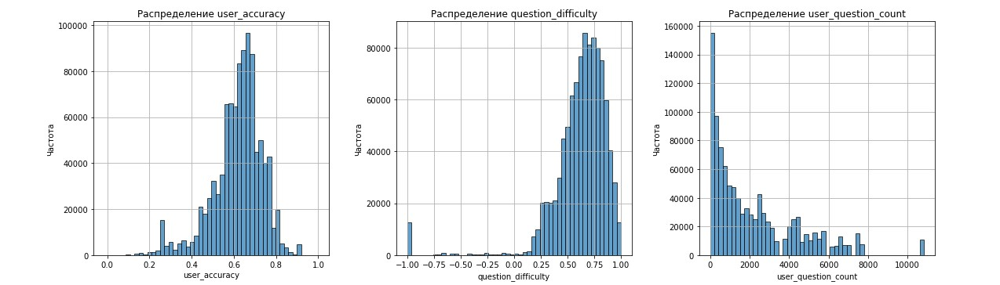

# MEPHI_Task1_StudentsTeasts_Analytics

#### Признаки

### Количество вопросов, отвеченных пользователем (user_question_count) — позволяет понять, насколько активно пользователь участвует в тестах.
### Среднее время ответа пользователя (user_avg_time) — помогает понять, насколько быстро или медленно пользователь отвечает на вопросы.
### Среднее время ответа на вопрос (question_avg_time) — показывает, сколько времени в среднем пользователи тратят на конкретные вопросы.
### Количество попыток ответа на вопрос (question_attempt_count) — может быть полезно для выявления сложных вопросов.
### Интерактивные признаки: взаимодействие точности пользователя и сложности вопроса, а также времени пользователя и сложности вопроса.
### Время с первого ответа пользователя (time_since_start) — помогает оценить, сколько времени прошло с момента начала обучения пользователя.
### Скользящее среднее точности пользователя (rolling_user_accuracy) — улучшает стабильность модели.
### Кумулятивная точность пользователя (cumulative_accuracy) — помогает отслеживать, как точность пользователя меняется с течением времени.

#### Чтобы посмотреть код вместе с данными train - загрузите этот код на платфорсу Kaggle https://www.kaggle.com/code/mlsputnik/riiid-answer-correctness-prediction-sk/edit#Riiid!-Answer-Correctness-Prediction.-Data-Analysis-and-visualization-and-Modeling
### Подключите к Input - данные train, questions, lessons - так было сделано так как датасет слишком большой 

# Мой проект

## Визуализация графика

Вот пример визуализации:

