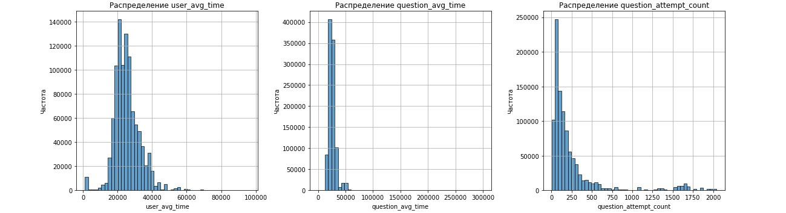
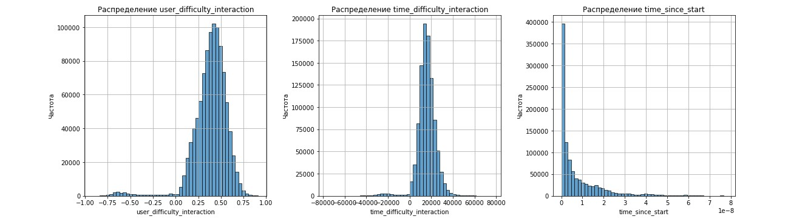

# MEPHI_Task1_StudentsTests_Analytics 🚀📚🎓🌟

Данный репозиторий представляет собой анализ данных о тестировании знаний студентов и предобработку признаков для последующего построения предиктивных моделей. Основная цель — оценить вероятность правильного ответа студента на вопрос и понять, как различные временные и статистические признаки влияют на качество ответов.

## Описание проекта 📖

В рамках задачи предполагается использовать данные о взаимодействиях студентов с тестовыми вопросами. Проект включает в себя анализ и извлечение признаков, которые помогут лучше понять поведение учащихся и сложность вопросов.

Разработанные признаки включают:

1. **Количество вопросов, отвеченных пользователем (`user_question_count`)**  
   Показывает активность пользователя.

2. **Среднее время ответа пользователя (`user_avg_time`)**  
   Отражает среднюю скорость реакции конкретного студента.

3. **Среднее время ответа на вопрос (`question_avg_time`)**  
   Позволяет оценить общую сложность вопроса по времени, затраченному на него всеми пользователями.

4. **Количество попыток ответа на вопрос (`question_attempt_count`)**  
   Помогает выявить проблемные или сложные вопросы.

5. **Интерактивные признаки:**  
   - Взаимодействие точности пользователя и сложности вопроса.  
   - Взаимодействие времени пользователя и сложности вопроса.

   Эти признаки позволяют учитывать индивидуальные особенности поведения пользователей на разных типах вопросов.

6. **Время с первого ответа пользователя (`time_since_start`)**  
   Показывает, как меняется поведение пользователя со временем.

7. **Скользящее среднее точности пользователя (`rolling_user_accuracy`)**  
   Сглаживает колебания точности, учитывая последние попытки.

8. **Кумулятивная точность пользователя (`cumulative_accuracy`)**  
   Отслеживает изменение точности по мере прогресса пользователя.

## Используемые данные 💻

Для анализа необходимо подключить следующие датасеты:  
- `train` — основная выборка взаимодействий (студент-вопрос-ответ)  
- `questions` — метаданные о вопросах  
- `lessons` — данные о последовательности обучения

Из-за большого размера датасета рекомендуется использовать платформу [Kaggle](https://www.kaggle.com/). Загрузите данный код и подключите данные через Input. Пример использования:  
[https://www.kaggle.com/code/mlsputnik/riiid-answer-correctness-prediction-sk/edit#Riiid!-Answer-Correctness-Prediction.-Data-Analysis-and-visualization-and-Modeling](https://www.kaggle.com/code/mlsputnik/riiid-answer-correctness-prediction-sk/edit#Riiid!-Answer-Correctness-Prediction.-Data-Analysis-and-visualization-and-Modeling)

## Структура репозитория 📂

- `lectures.csv/` — лекции
- `questions.csv/` - вопросы
- `riiid-answer-correctness-prediction/` — ноутбук с кодом для анализа данных и генерации признаков
- `Students_Analytics_1.jpg`etc.- изображения графиков распределения признаков, влияющих на успешность студента
- `README.md` — текущее описание проекта

## Как использовать 🤔

1. Склонируйте репозиторий или скачайте его.
2. Загрузите ноутбук на Kaggle.
3. Подключите необходимые датасеты (`train`, `questions`, `lessons`) к Input.
4. Запустите ноутбук для анализа данных, генерации признаков и визуализации.

## Дополнительно 🌐

- Полученные признаки можно использовать в моделях машинного обучения (XGBoost, LightGBM, CatBoost или нейросети) для предсказания правильности ответов.
- Результаты анализа могут помочь в улучшении адаптивных образовательных систем и выявлении сложных вопросов.

## Лицензия ⚖️

Проект распространяется под лицензией MIT. Подробности — в файле [LICENSE](./LICENSE).

## Визуализация распределения признаков

